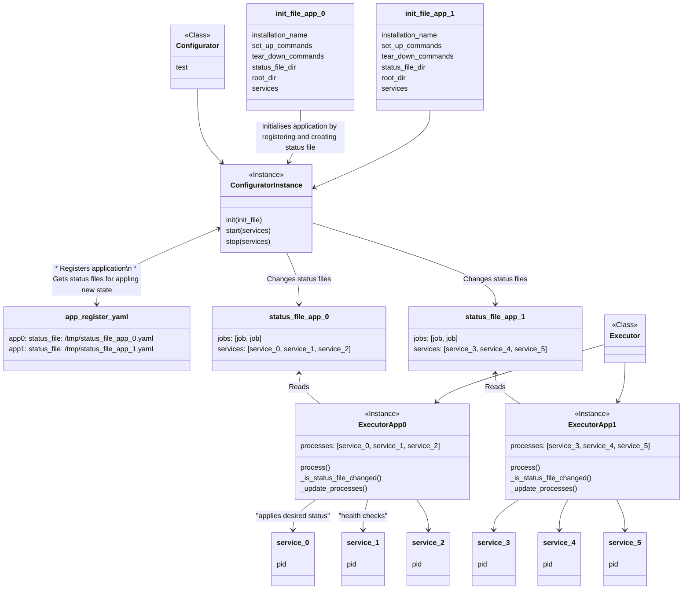

```mermaid
classDiagram
Configurator-->ConfiguratorInstance
ConfiguratorInstance<-->app_register_yaml: * Registers application\n * Gets status files for appling new state

status_file_app_0<--ExecutorApp0: Reads
status_file_app_1<--ExecutorApp1: Reads

ConfiguratorInstance-->status_file_app_0: Changes status files
ConfiguratorInstance-->status_file_app_1: Changes status files

Executor-->ExecutorApp0
Executor-->ExecutorApp1
<<Class>>Executor

ExecutorApp0-->service_0: "applies desired status"
ExecutorApp0-->service_1: "health checks"
ExecutorApp0-->service_2

ExecutorApp1-->service_3
ExecutorApp1-->service_4
ExecutorApp1-->service_5

init_file_app_0-->ConfiguratorInstance: Initialises application by registering and creating status file
init_file_app_1-->ConfiguratorInstance

class ConfiguratorInstance{
    init(init_file)
    start(services)
    stop(services)
}
<<Instance>>ConfiguratorInstance

class Configurator{
    test
}
<<Class>>Configurator

class ExecutorApp0{
    processes: [service_0, service_1, service_2]

    process()
    _is_status_file_changed()
    _update_processes()
}
<<Instance>>ExecutorApp0

class ExecutorApp1{
    processes: [service_3, service_4, service_5]

    process()
    _is_status_file_changed()
    _update_processes()
}
<<Instance>>ExecutorApp1

class status_file_app_0{
    jobs: [job, job]
    services: [service_0, service_1, service_2]
}

class status_file_app_1{
    jobs: [job, job]
    services: [service_3, service_4, service_5]
}


class service_0{
    pid
}

class service_1{
    pid
}

class service_2{
    pid
}

class service_3{
    pid
}

class service_4{
    pid
}

class service_5{
    pid
}

class init_file_app_0{
    installation_name
    set_up_commands
    tear_down_commands
    status_file_dir
    root_dir
    services
}

class init_file_app_1{
    installation_name
    set_up_commands
    tear_down_commands
    status_file_dir
    root_dir
    services
}


class app_register_yaml{
    app0: status_file: /tmp/status_file_app_0.yaml
    app1: status_file: /tmp/status_file_app_1.yaml
}

```