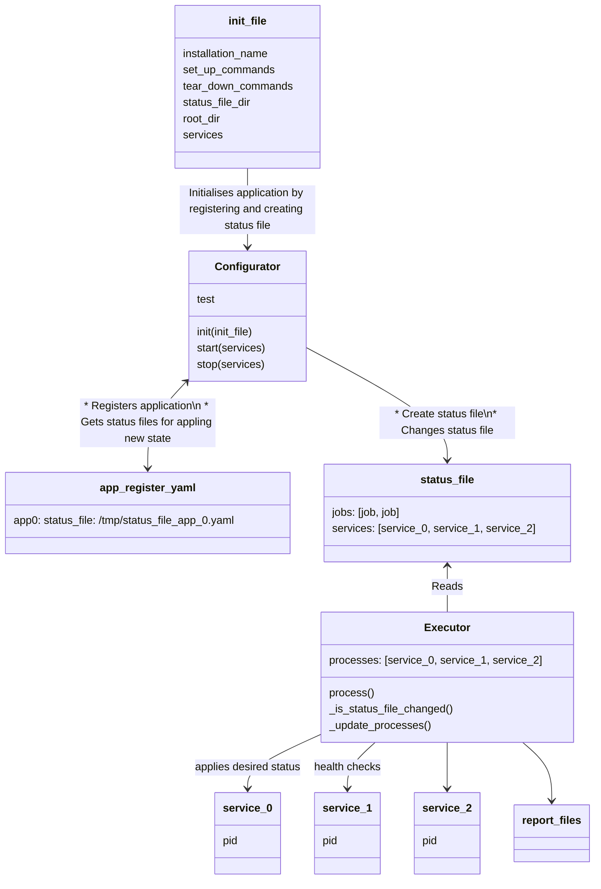

```mermaid
classDiagram
Configurator<-->app_register_yaml: * Registers application\n * Gets status files for appling new state

status_file<--Executor: Reads

Configurator-->status_file: * Create status file\n* Changes status file


Executor-->service_0: applies desired status
Executor-->service_1: health checks
Executor-->service_2
Executor-->report_files

init_file-->Configurator: Initialises application by registering and creating status file

class Configurator{
    init(init_file)
    start(services)
    stop(services)
}

class Configurator{
    test
}

class Executor{
    processes: [service_0, service_1, service_2]

    process()
    _is_status_file_changed()
    _update_processes()
}

class status_file{
    jobs: [job, job]
    services: [service_0, service_1, service_2]
}

class service_0{
    pid
}

class service_1{
    pid
}

class service_2{
    pid
}

class init_file{
    installation_name
    set_up_commands
    tear_down_commands
    status_file_dir
    root_dir
    services
}

class app_register_yaml{
    app0: status_file: /tmp/status_file_app_0.yaml
}
```